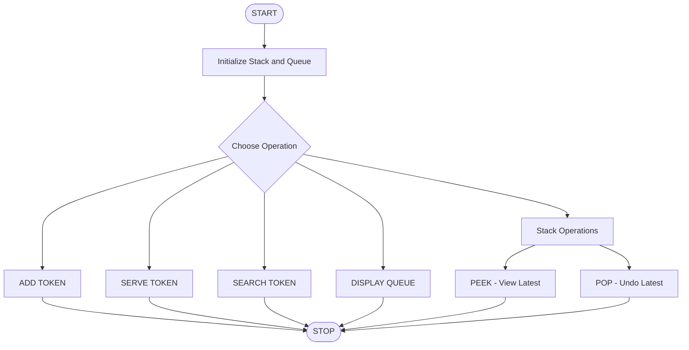

```mermaid
flowchart TD
    A([START]) --> B[Initialize Stack and Queue]
    B --> C{Choose Operation}

    C --> D[ADD TOKEN]
    C --> E[SERVE TOKEN]
    C --> F[SEARCH TOKEN]
    C --> G[DISPLAY QUEUE]
    C --> H[Stack Operations]

    H --> H1[PEEK - View Latest]
    H --> H2[POP - Undo Latest]

    D --> Z([STOP])
    E --> Z
    F --> Z
    G --> Z
    H1 --> Z
    H2 --> Z
```
