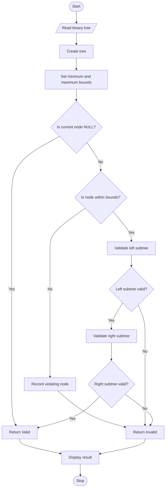

# Flowchart - Valid BST Check

```mermaid
flowchart TD
    A([Start]) --> B[/Read binary tree/]
    B --> C[Create tree]
    C --> D[Set minimum and maximum bounds]
    D --> E{Is current node NULL?}
    E -- Yes --> F[Return Valid]
    E -- No --> G{Is node within bounds?}
    G -- No --> H[Record violating node]
    H --> I[Return Invalid]
    G -- Yes --> J[Validate left subtree]
    J --> K{Left subtree valid?}
    K -- No --> I
    K -- Yes --> L[Validate right subtree]
    L --> M{Right subtree valid?}
    M -- No --> I
    M -- Yes --> F
    F --> N[Display result]
    I --> N
    N --> O([Stop])
```
