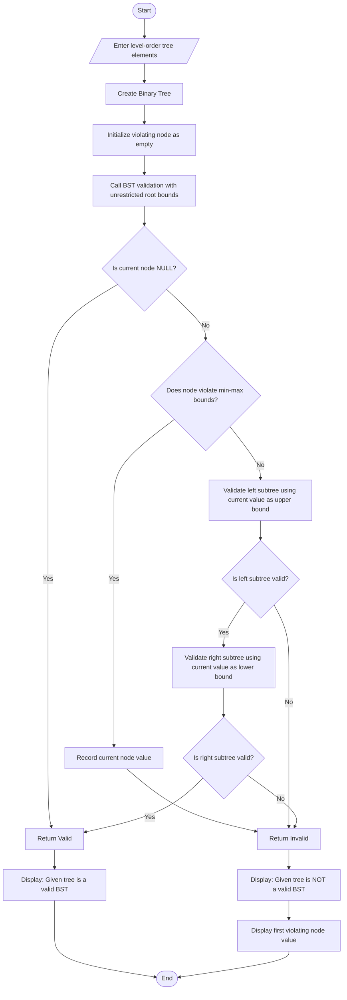

```mermaid
flowchart TD
    A([Start]) --> B[/Enter level-order tree elements/]
    B --> C[Create Binary Tree]
    C --> D[Initialize violating node as empty]
    D --> E[Call BST validation with unrestricted root bounds]
    E --> F{Is current node NULL?}
    F -- Yes --> G[Return Valid]
    F -- No --> H{Does node violate min-max bounds?}
    H -- Yes --> I[Record current node value]
    I --> J[Return Invalid]
    H -- No --> K[Validate left subtree using current value as upper bound]
    K --> L{Is left subtree valid?}
    L -- No --> J
    L -- Yes --> M[Validate right subtree using current value as lower bound]
    M --> N{Is right subtree valid?}
    N -- No --> J
    N -- Yes --> G
    G --> O[Display: Given tree is a valid BST]
    J --> P[Display: Given tree is NOT a valid BST]
    P --> Q[Display first violating node value]
    O --> R([End])
    Q --> R
```
