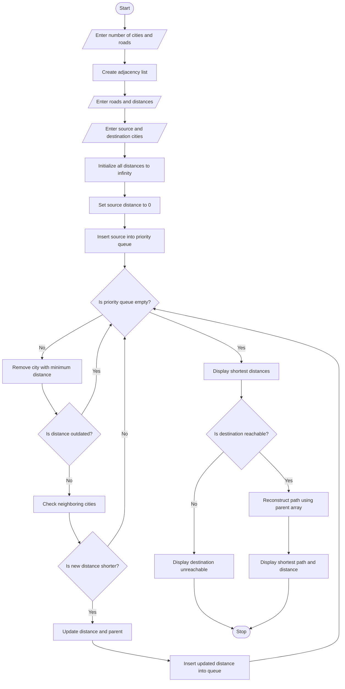

```mermaid
flowchart TD
    A([Start]) --> B[/Enter number of cities and roads/]
    B --> C[Create adjacency list]
    C --> D[/Enter roads and distances/]
    D --> E[/Enter source and destination cities/]
    E --> F[Initialize all distances to infinity]
    F --> G[Set source distance to 0]
    G --> H[Insert source into priority queue]
    H --> I{Is priority queue empty?}
    I -- No --> J[Remove city with minimum distance]
    J --> K{Is distance outdated?}
    K -- Yes --> I
    K -- No --> L[Check neighboring cities]
    L --> M{Is new distance shorter?}
    M -- Yes --> N[Update distance and parent]
    N --> O[Insert updated distance into queue]
    O --> I
    M -- No --> I
    I -- Yes --> P[Display shortest distances]
    P --> Q{Is destination reachable?}
    Q -- No --> R[Display destination unreachable]
    Q -- Yes --> S[Reconstruct path using parent array]
    S --> T[Display shortest path and distance]
    R --> U([Stop])
    T --> U
```
