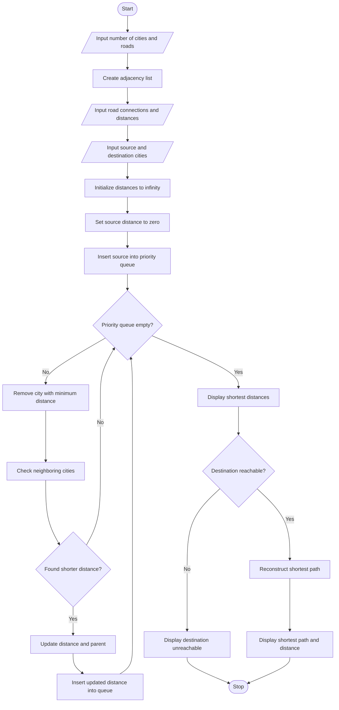

```mermaid
flowchart TD
    A([Start]) --> B[/Input number of cities and roads/]
    B --> C[Create adjacency list]
    C --> D[/Input road connections and distances/]
    D --> E[/Input source and destination cities/]
    E --> F[Initialize distances to infinity]
    F --> G[Set source distance to zero]
    G --> H[Insert source into priority queue]
    H --> I{Priority queue empty?}
    I -- No --> J[Remove city with minimum distance]
    J --> K[Check neighboring cities]
    K --> L{Found shorter distance?}
    L -- Yes --> M[Update distance and parent]
    M --> N[Insert updated distance into queue]
    N --> I
    L -- No --> I
    I -- Yes --> O[Display shortest distances]
    O --> P{Destination reachable?}
    P -- No --> Q[Display destination unreachable]
    P -- Yes --> R[Reconstruct shortest path]
    R --> S[Display shortest path and distance]
    Q --> T([Stop])
    S --> T
```
