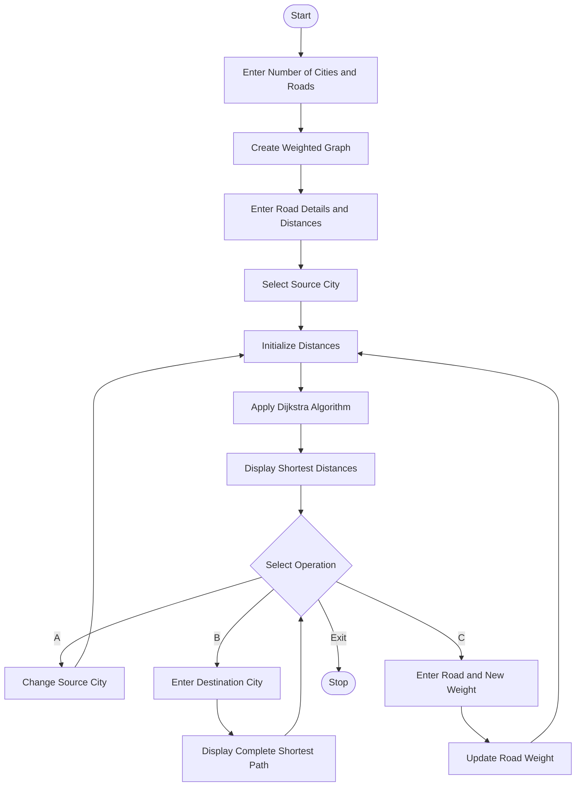

```mermaid
flowchart TD
    A([Start]) --> B[Enter Number of Cities and Roads]
    B --> C[Create Weighted Graph]
    C --> D[Enter Road Details and Distances]
    D --> E[Select Source City]
    E --> F[Initialize Distances]
    F --> G[Apply Dijkstra Algorithm]
    G --> H[Display Shortest Distances]
    H --> I{Select Operation}

    I -->|A| J[Change Source City]
    J --> F

    I -->|B| K[Enter Destination City]
    K --> L[Display Complete Shortest Path]
    L --> I

    I -->|C| M[Enter Road and New Weight]
    M --> N[Update Road Weight]
    N --> F

    I -->|Exit| O([Stop])
```
