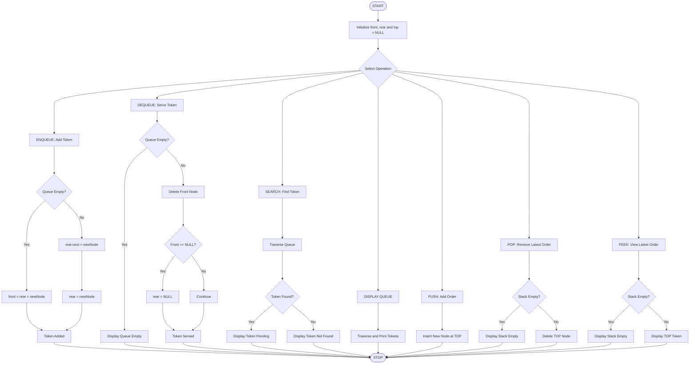

```mermaid
flowchart TD
    A([START]) --> B["Initialize front, rear and top = NULL"]
    B --> C{"Select Operation"}

    C --> D["ENQUEUE: Add Token"]
    D --> E{"Queue Empty?"}
    E -- Yes --> F["front = rear = newNode"]
    E -- No --> G["rear.next = newNode"]
    G --> H["rear = newNode"]
    F --> I["Token Added"]
    H --> I

    C --> J["DEQUEUE: Serve Token"]
    J --> K{"Queue Empty?"}
    K -- Yes --> L["Display Queue Empty"]
    K -- No --> M["Delete Front Node"]
    M --> N{"Front == NULL?"}
    N -- Yes --> O["rear = NULL"]
    N -- No --> P["Continue"]
    O --> Q["Token Served"]
    P --> Q

    C --> R["SEARCH: Find Token"]
    R --> S["Traverse Queue"]
    S --> T{"Token Found?"}
    T -- Yes --> U["Display Token Pending"]
    T -- No --> V["Display Token Not Found"]

    C --> W["DISPLAY QUEUE"]
    W --> X["Traverse and Print Tokens"]

    C --> Y["PUSH: Add Order"]
    Y --> Z["Insert New Node at TOP"]

    C --> AA["POP: Remove Latest Order"]
    AA --> AB{"Stack Empty?"}
    AB -- Yes --> AC["Display Stack Empty"]
    AB -- No --> AD["Delete TOP Node"]

    C --> AE["PEEK: View Latest Order"]
    AE --> AF{"Stack Empty?"}
    AF -- Yes --> AG["Display Stack Empty"]
    AF -- No --> AH["Display TOP Token"]

    I --> AI([STOP])
    L --> AI
    Q --> AI
    U --> AI
    V --> AI
    X --> AI
    Z --> AI
    AC --> AI
    AD --> AI
    AG --> AI
    AH --> AI
```
