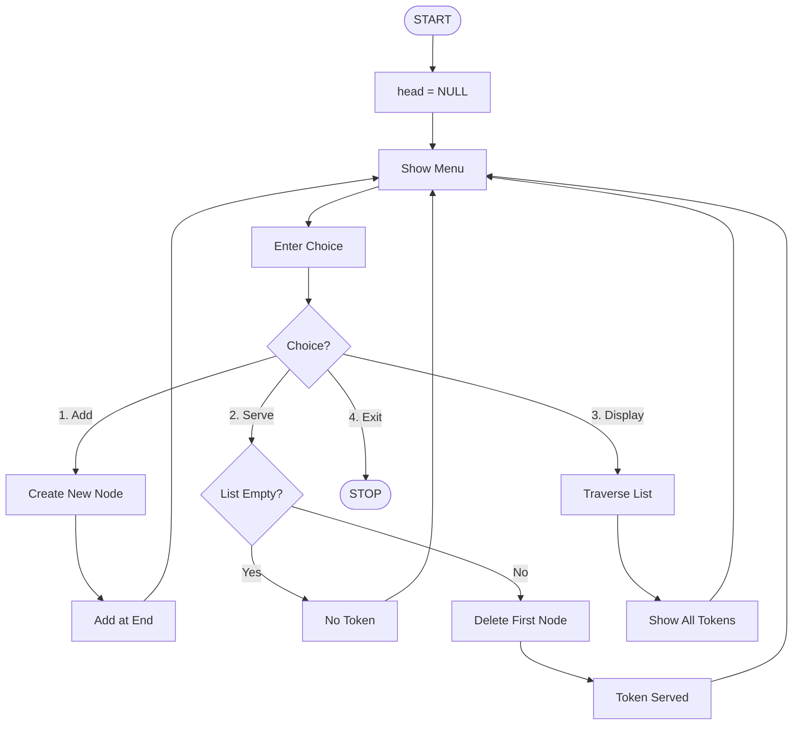

```mermaid
flowchart TD
    A([START]) --> B[head = NULL]
    B --> C[Show Menu]

    C --> D[Enter Choice]

    D --> E{Choice?}
    
    E -- 1. Add --> F[Create New Node]
    F --> G[Add at End]
    G --> C

    E -- 2. Serve --> H{List Empty?}
    H -- Yes --> I[No Token]
    H -- No --> J[Delete First Node]
    J --> K[Token Served]
    I --> C
    K --> C

    E -- 3. Display --> L[Traverse List]
    L --> M[Show All Tokens]
    M --> C

    E -- 4. Exit --> N([STOP])
```
