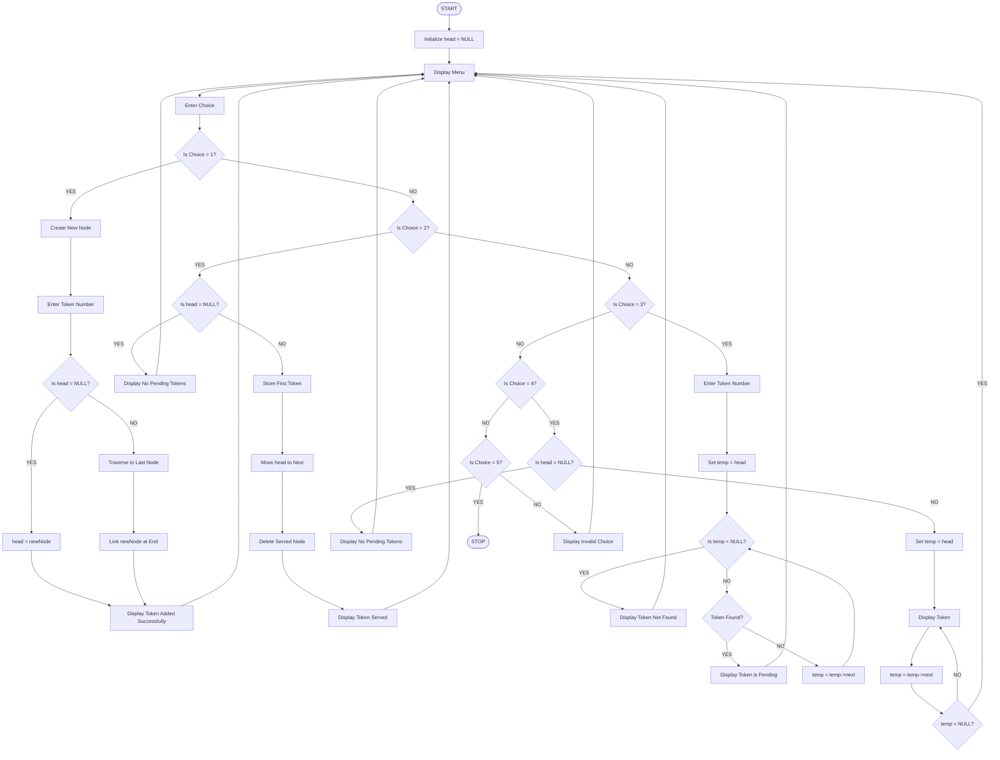

```mermaid
flowchart TD
    A([START]) --> B[Initialize head = NULL]
    B --> C[Display Menu]
    C --> D[Enter Choice]

    D --> E{Is Choice = 1?}
    E -- YES --> F[Create New Node]
    F --> G[Enter Token Number]
    G --> H{Is head = NULL?}
    H -- YES --> I[head = newNode]
    H -- NO --> J[Traverse to Last Node]
    J --> K[Link newNode at End]
    I --> L[Display Token Added Successfully]
    K --> L
    L --> C

    E -- NO --> M{Is Choice = 2?}
    M -- YES --> N{Is head = NULL?}
    N -- YES --> O[Display No Pending Tokens]
    N -- NO --> P[Store First Token]
    P --> Q[Move head to Next]
    Q --> R[Delete Served Node]
    R --> S[Display Token Served]
    O --> C
    S --> C

    M -- NO --> T{Is Choice = 3?}
    T -- YES --> U[Enter Token Number]
    U --> V[Set temp = head]
    V --> W{Is temp = NULL?}
    W -- YES --> X[Display Token Not Found]
    W -- NO --> Y{Token Found?}
    Y -- YES --> Z[Display Token is Pending]
    Y -- NO --> AA[temp = temp->next]
    AA --> W
    X --> C
    Z --> C

    T -- NO --> AB{Is Choice = 4?}
    AB -- YES --> AC{Is head = NULL?}
    AC -- YES --> AD[Display No Pending Tokens]
    AC -- NO --> AE[Set temp = head]
    AE --> AF[Display Token]
    AF --> AG[temp = temp->next]
    AG --> AH{temp = NULL?}
    AH -- NO --> AF
    AH -- YES --> C
    AD --> C

    AB -- NO --> AI{Is Choice = 5?}
    AI -- YES --> AJ([STOP])
    AI -- NO --> AK[Display Invalid Choice]
    AK --> C
```
