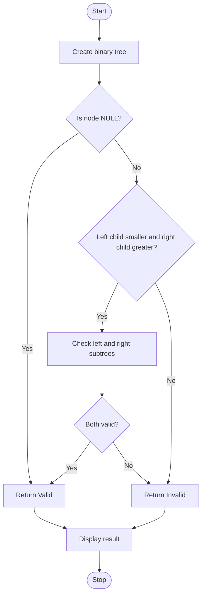

### Flowchart

```mermaid
flowchart TD
    A([Start]) --> B[Create binary tree]
    B --> C{Is node NULL?}
    C -- Yes --> D[Return Valid]
    C -- No --> E{Left child smaller and right child greater?}
    E -- Yes --> F[Check left and right subtrees]
    F --> G{Both valid?}
    G -- Yes --> D
    G -- No --> H[Return Invalid]
    E -- No --> H
    D --> I[Display result]
    H --> I
    I --> J([Stop])
```
